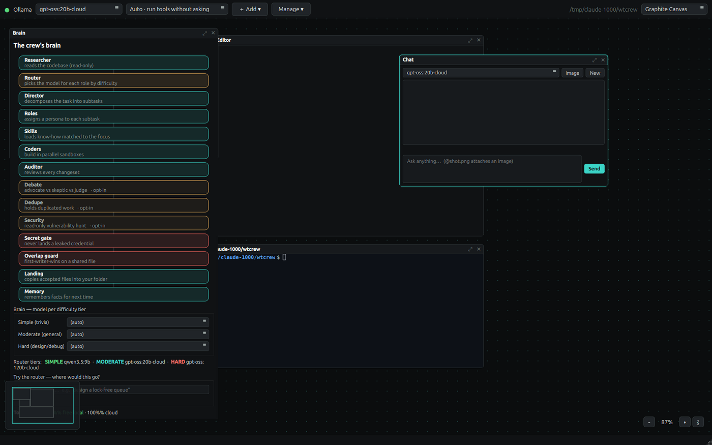
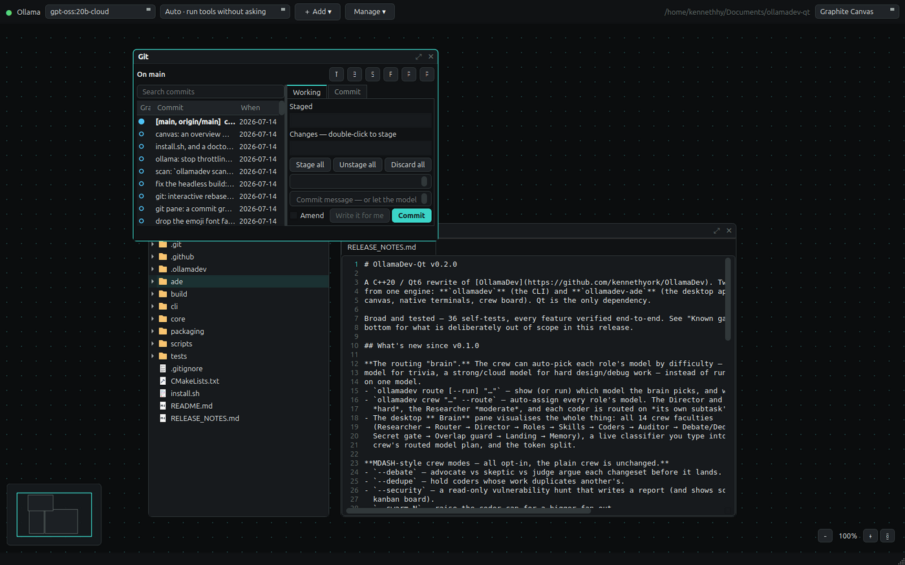

# OllamaDev

**A local AI coding agent with a crew.** A Director plans the work, several coders build it in
parallel — each in its own git worktree — and an Auditor reads every diff before any of it touches
your files.

Ollama-native. C++20 / Qt6, and **Qt is the only dependency**. No account, no API key, no telemetry,
no credits. Your code stays on your machine.



---

## Install

You need [Ollama](https://ollama.com) running, and Qt6.

```sh
# Debian / Ubuntu
sudo apt install build-essential cmake ninja-build qt6-base-dev \
     qt6-webengine-dev libqt6svg6-dev

git clone https://github.com/kennethyork/OllamaDev-Qt.git
cd OllamaDev-Qt
./install.sh            # builds, runs the tests, installs the CLI + the desktop app

ollamadev setup         # picks and pulls a model for your hardware
ollamadev doctor        # check it over
```

`install.sh` puts `ollamadev` and `ollamadev-ade` in `~/.local/bin` and adds a menu entry. Run it
again after you pull — `doctor` warns you if the binary on your PATH has gone stale.

Cloud models work through **your own** `ollama signin`. There are no keys in this app, and nothing is
routed through anyone else's account.

---

## The crew

```
$ ollamadev crew "add rate limiting to the API and document it"

▸ plan: director is decomposing the task
    coder #1 [coder] ollama:gpt-oss:120b-cloud · hard
    coder #2 [docs]  ollama:gpt-oss:20b-cloud  · moderate
▸ build: 2 coders working
▸ audit: reviewing every changeset
▸ land: applying clean work
    applied #1 (2 files)
    held    #2 — audit flagged: adds code beyond the docs-only subtask
▸ done: 1 applied · 1 held
```

Each coder works in its **own git worktree**, sharing the object store — so it gets a real repo it can
read the history of, and your working tree is untouched until work is accepted. Your uncommitted
changes and untracked files are replicated into every sandbox, so a coder sees exactly what you see.

Clean work lands. Contested work waits on the board:

```sh
ollamadev board                                    # what's held, and why
ollamadev crew accept 2                            # apply it
ollamadev crew discard 2                           # bin it
ollamadev crew steer 2 "use the existing logger"   # talk to a running coder
ollamadev crew resume                              # finish an interrupted run
```

**Always on:** an Auditor that holds anything wrong, unsafe, or outside the subtask it was given · a
secret scanner that blocks a leaked credential from landing *or* being committed · a first-writer-wins
guard when two coders touch the same file.

`crew resume` keeps every coder that finished — landing their work from disk with zero model calls —
and the Director re-plans only what's left.

### The brain — all opt-in

Difficulty is a property of the *subtask*, not the role.

```sh
$ ollamadev route "rename a variable"
→ simple   ollama:qwen3.5:9b        (short lookup-style question)

$ ollamadev route "design a lock-free queue"
→ hard     ollama:gpt-oss:120b-cloud
```

| Flag | What it does |
|---|---|
| `--route` | Pick each subtask's model by difficulty. |
| `--amplify N` | N independent Director plans, keep the consensus shape — and an N-reviewer audit panel needing a **strict majority** to land anything. A 2–2 split holds the change. |
| `--debate` | Advocate vs skeptic vs judge, per changeset. |
| `--dedupe` | Hold a coder whose work duplicates another's. |
| `--security` | A read-only vulnerability hunt. Writes a report, changes nothing. |
| `--learn` | Distil what the run taught into memory and a reusable skill, and load it back next time. |
| `--swarm N` | Raise the coder **cap** (pair with `--max N` to actually run more). |
| `--pack <name>` | Start from a saved team. Your flags still win. |

With none of these set, the crew is exactly as it was.

---

## Git, properly



A real git client on the canvas — commit graph, staged/unstaged, inline diff, branches, stashes, tags
— plus an **AI interactive rebase**: the model reads your commits and proposes which to fold together
and which to reword. You approve every line before anything is rewritten, and a backup ref is taken
first, so it is always undoable.

```sh
ollamadev commit -a       # a Conventional Commit from the staged diff. A secret BLOCKS it.
ollamadev ship            # stage → scan → commit → ask → push
ollamadev tidy 10         # AI interactive rebase over the last 10 commits
ollamadev scan            # hunt the tree for leaked credentials
```

Every destructive action names what it will destroy. Force-push is always `--force-with-lease`.

---

## Everything else

| | |
|---|---|
| **47 built-in tools** | read, write, edit, patch, glob, grep, bash, background shells, semantic code search, the web — and 17 `git_*` tools. Native Ollama function calling; no text-scraping fallback. |
| **ACP + LSP** | An Agent Client Protocol server, so an editor can drive the agent — permission prompts and all. And a language server: hover, completion, go-to-definition, rename, real compiler-backed diagnostics. |
| **Providers** | Ollama local *and* cloud, plus Claude Code, Codex, Gemini, cursor-agent, opencode, qwen. Mix providers inside one crew — a different backend per coder. |
| **Vision** | `@shot.png` in any prompt. |
| **Extend** | Skills, wiki-linked memory, MCP servers, and plugins — installed disabled, and enabling shows you the exact shell commands first. |
| **Voice** | Local speech-to-text. Steer the crew without typing. |
| **Desktop** | Infinite canvas, dot grid, overview map, Ctrl-K palette, real PTY terminals, 37 themes. |

---

## Commands

```
ollamadev                    interactive agent (-c resumes this folder's session)
ollamadev "<prompt>"         one-shot: it reads, edits, runs, then stops
ollamadev crew "<task>"      the parallel bench
ollamadev board              held work, waiting on you
ollamadev commit | ship      the AI git workflow
ollamadev tidy [N]           AI interactive rebase
ollamadev scan               secret scanner
ollamadev route "<task>"     which model the brain picks, and why
ollamadev code-search "<q>"  search the repo by meaning
ollamadev eval               a fixed task suite → a comparable pass rate
ollamadev acp | lsp          serve an editor
ollamadev-ade                the desktop app
```

`ollamadev --help` has the rest.

---

## What it is, and what it isn't

Being straight with you: this is a real tool that does real work, but it is early, and it is one
person's project.

- **Linux only** today. The code is Qt6 and should port, but macOS and Windows are neither built nor
  tested. Do not assume they work.
- **Build from source.** No signed installers yet.
- **205 assertions** in the self-test suite, all passing — `install.sh` runs them on every build. Every
  feature listed here was driven end-to-end against a live model before it was written down.
- **Not a hosted product.** No account, no telemetry, no credits, nothing to bill you for — and
  equally, nobody on call when it breaks.

---

## Building

```sh
cmake -S . -B build -DCMAKE_BUILD_TYPE=Release
cmake --build build -j
./build/tests/odv-tests
```

Qt 6.2+ (Core, Network, Concurrent, Widgets) and a C++20 compiler. That is the whole list — there is
no third-party library anywhere in this repo, deliberately. `QJsonDocument` is the JSON parser,
`QRegularExpression` *is* PCRE2, `QProcess` drives the coding CLIs, and `forkpty()` gives the
terminals (no libvterm, no QTermWidget).

| Option | Default | |
|---|---|---|
| `ODV_BUILD_ADE` | `ON` | `OFF` gives a headless CLI-only build that needs no GUI Qt packages. |
| `ODV_WEBENGINE` | `ON` | QtWebEngine browser pane; falls back to a reader if absent. |

---

## Licence

**[AGPL-3.0](LICENSE).** Free to use, study, modify and share.

The one thing it asks in return: if you modify OllamaDev and let other people use it — including
**over a network, as a hosted service** — you have to offer them your modified source too. Running it
on your own machine, for your own work, carries no obligation at all.

If that does not suit you, ask me about a different licence.
